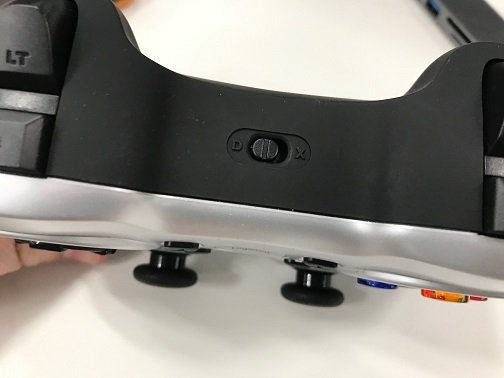
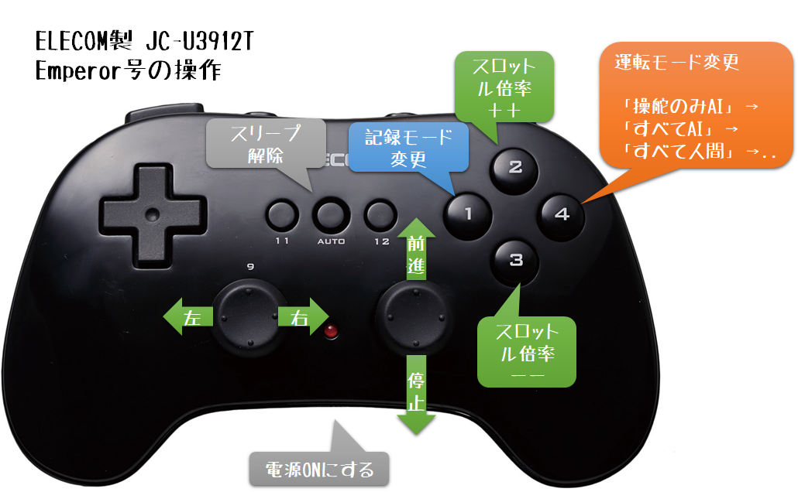

# Donkey Car用ジョイスティックコントローラ

Donkey Carの手動運転にて以下のコントローラを使用可能にします。

* [Logicool Wireress GamePad F710](https://amzn.to/2R85kAK)
   F710の上面に"D"か"X"のどちらかに設定できるスイッチが用意されています。
   これは、従来の DirectInput に準拠したドライバを使って接続するかどうかを選択できます。
   Xinput のほうが新しく、Logoボタンのコントロールまで可能になっています。


   

* [ELECOM Wireress GamePad JC-U3912T](https://amzn.to/2SddDvo)

ともにUSBドングルが同梱された製品であるため、Raspberry Pi上でのbluetooth設定が不要です。

> ドングルを刺さずに、Raspberry Pi本体上に搭載されたBluetoothデバイスを使用することもできますが、本サイトでは紹介しません。

本コードでは [autorope/donkeypart_bluetooth_game_controller](https://github.com/autorope/donkeypart_bluetooth_game_controller) パッケージを使用しています。

## 1 インストール

Raspberry Pi上にdonkeycarパッケージがインストールされ、`donkey createcar`コマンドで独自アプリ用ディレクトリ`~/mycar`が作成されている状態とします。

> donkeypart_bluetooth_game_controller パッケージでは、Wii-Uコントローラを標準でサポートしています(かわりにPS3/PS4コントローラはサポートされていません)。
> Wii-Uコントローラのみを使用する場合は、このリポジトリは不要です。


1. Raspberry Pi にターミナル接続します。
2. 以下のコマンドを実行して、前提パッケージ`donkeypart_bluetooth_game_controller`をインストールします。
    ```bash
    cd
    git clone https://github.com/autorope/donkeypart_bluetooth_game_controller.git
    cd donkeypart_bluetooth_game_controller
    pip install -e .
    ```
3. 以下のコマンドを実行して、本リポジトリをcloneします。
    ```bash
    cd
    git clone https://github.com/coolerking/donkeypart_game_controller.git
    ```
4. 以下のコマンドを実行して、必要なファイルを`~/mycar/elecom` (ELECOM JC-U3912Tの場合)へコピーします。
    ```bash
    mkdir ~/mycar/elecom
    cp ~/donkeypart_game_controller/elecom/* ~/mycar/elecom/
    ```

 * Logicool F710 の場合
    ```bash
    mkdir ~/mycar/logicool
    cp ~/donkeypart_game_controller/logicool/* ~/mycar/logicool/
    ```
5. `~/mycar/manage.py` を、以下のように編集します(ELECOM JC-U3912Tの場合)。
    ```python
        # manage.py デフォルトのジョイスティックpart生成
        #if use_joystick or cfg.USE_JOYSTICK_AS_DEFAULT:
        #    ctr = JoystickController(max_throttle=cfg.JOYSTICK_MAX_THROTTLE,
        #                             steering_scale=cfg.JOYSTICK_STEERING_SCALE,
        #                             throttle_axis=cfg.JOYSTICK_THROTTLE_AXIS,
        #                             auto_record_on_throttle=cfg.AUTO_RECORD_ON_THROTTLE)
        # ジョイスティック part の生成
        if use_joystick or cfg.USE_JOYSTICK_AS_DEFAULT:
            # wii-U コントローラを使用
            #from donkeypart_bluetooth_game_controller import BluetoothGameController
            #ctl = BluetoothGameController()
            # F710用ジョイスティックコントローラを使用
            #from logicool import JoystickController
            # ELECOM JC-U3912T ジョイスティックコントローラを使用
            from elecom import JoystickController
            ctr = JoystickController()
    ```

6. Raspberry Piをシャットダウンします。
7. コントローラ同梱のUSBドングルをRaspberry Piに刺します。
8. Raspberry Piを再起動します。

## 2 キー割り当ての変更

Logicool製品の場合は `logicool/__init__.py`、Elecom製品の場合は `elecom/__init__
.py`上の各 `JoystickController` クラス上のインスタンス変数 `self.func_map` を編集することで、ジョイスティックのキーの割当機能を変更できます。

以下の関数は、`elecom/__init__.py`より該当箇所のみ切り出した例です(Logicoolの場合も同じ位置のボタンに機能を割り当てています)。

```python
        # 独自関数マップ　書き換え(key:ボタン名, value:呼び出す関数)
        self.func_map = {
            'LEFT_STICK_X': self.update_angle,     # アングル値更新
            'RIGHT_STICK_Y': self.update_throttle, # スロットル値更新
            '1': self.toggle_recording,            # 記録モード変更
            '4': self.toggle_drive_mode,           # 運転モード変更
            '2': self.increment_throttle_scale,    # スロットル倍率増加
            '3': self.decrement_throttle_scale,    # スロットル倍率減少
        }
```



ボタンとイベントデータとのマッピングは `logicool/f710.yml` もしくは `elecom/jc_u3912t.yml` を参照してください。

## 3 実行(手動/自動運転)

* 以下のコマンドを実行して、ジョイスティックを使った手動運転を開始します。
   ```bash
   cd ~/mycar
   # JC-U3912Tのデフォルト設定の場合"4"ボタンで運転モードを切り替え
   python manage.py drive --js
   ```

# A ライセンス

本リポジトリの上記OSSで生成、コピーしたコード以外のすべてのコードは[MITライセンス](./LICENSE)準拠とします。

